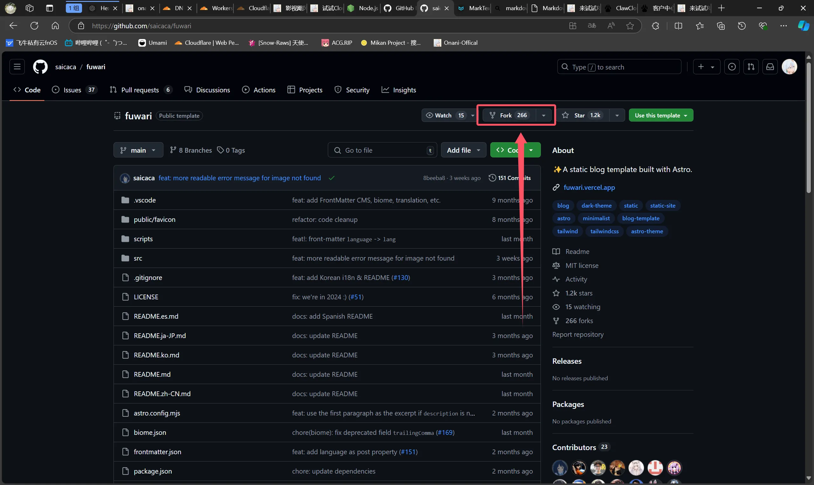

欢迎来到示例文章！下面这篇内容会覆盖大多数写作场景，帮助你快速验证渲染链路是否正常。

## 目录

- 封面图与摘要
- 文字与列表
- 数学公式（KaTeX）
- 提示块（GitHub 风格）
- 代码块（Expressive Code）
- 图片与灯箱
- 引用与分割线

---

## 封面图与摘要

这篇文章的 frontmatter 已设置：

- description：用于展示在标题下方的摘要
- image：使用远程 URL 作为封面图，`ImageWrapper` 会处理加载与过渡

## 文字与列表

这是一些普通段落文本。Fuwari 主题使用 Tailwind 的 Typography 来优化段落间距与可读性。

无序列表：

- 简洁直观
- 支持嵌套
	- 子项 1
	- 子项 2

有序列表：

1. 第一步
2. 第二步
3. 第三步

## 数学公式（KaTeX）

行内公式示例：$E=mc^2$。

块级公式示例：

$$
\int_0^{2\pi} \sin(x)\,dx = 0
$$

## 提示块（GitHub 风格）

> [!TIP]
> 这是一个提示块。你可以用它强调注意事项、最佳实践或快捷技巧。

> [!NOTE]
> 这是一个说明块。支持多种类型（TIP/NOTE/IMPORTANT/WARNING/CAUTION）。

## 代码块（Expressive Code）

```ts
function greet(name: string) {
	return `Hello, ${name}!`
}

console.log(greet("Fuwari"))
```

还可以展示 shell 命令：

```bash
pnpm new-post hello-world
pnpm dev
```

## 图片与灯箱

你可以直接引用远程图片地址：


也可以把图片放到 `src/content/assets/images/`，然后用相对路径引用：

```markdown

```

## 引用与分割线

> 这是一段引用。引用可以包含多段文字和行内格式。

---

至此，一篇示例文章就完成了。你可以基于这篇示例继续创作，或使用 `pnpm new-post <filename>` 创建你的下一篇文章。
